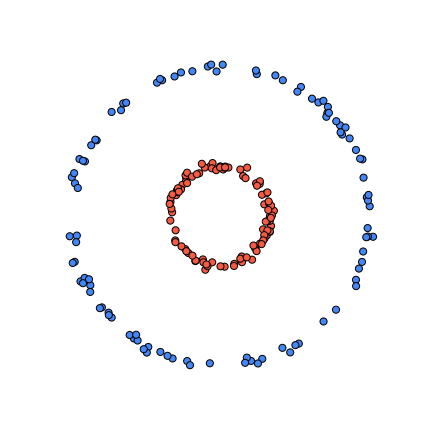
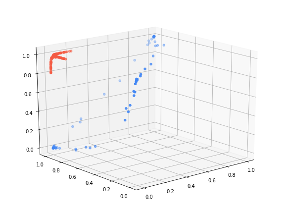
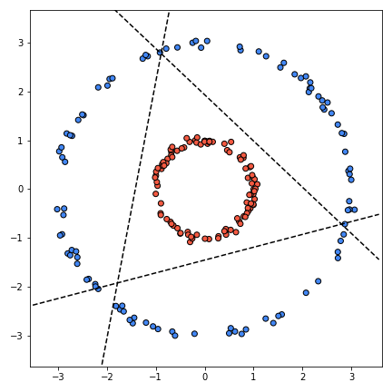
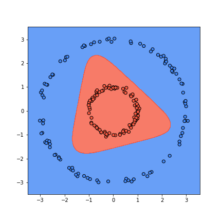

# Multilayer Perceptron

This repository contains the implementation for a blog post I wrote about [Multilayer Perceptrons](https://giothinks.com/multilayer-perceptron/). This is an attempt to show what an MLP is doing during learning and what's the intuition behind the formulation.

To motivate the problem of going beyond linear classifiers, I'm using a non-linear synthetic dataset, two concentric circles (data generation code is in the notebook).

The notebook also contains visualizations of the learned units (pre-activation), the learned hidden transformation that makes the dataset linearly separable and finally the learned decision boundary in the original space.

## Visualizations

### Learned Transformation

### Learned Units

### Decision Boundary

